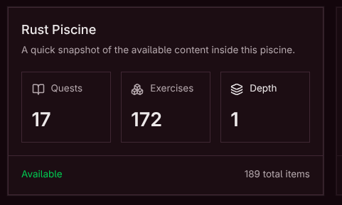
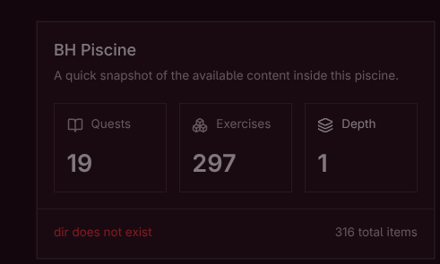

# testery

This is a tester for the piscine exercises, and please read the notes below before contacting me (trust me it's very short), I WILL NOT answer any questions that are already answered in this readme.

## Getting Started

READ THIS SHIT BEFORE CONTACTING ME (PLEASE I BEG YOU)

1. clone the repo

```
git clone https://github.com/nasoooor29/testery.git
```

2. make sure you have docker, pnpm installed and avaliable
3. run the script

```
bash ./scripts/run.sh
```

this will work on all the piscines on reboot. just open the tester, go to the config page, and set the repos directory to the absolute path of the directory that contains your piscine repos. and please put the ABOLUTE PATH, please read this shit before contacting me.

if you did it right my tester will show you a green badge on the piscine page



if you didn't it will display the error message below



here is a youtube tutorial if you are stupid and can't read the instructions above: [HERE](https://www.youtube.com/watch?v=KW1qCVi-29g)

## NOTES:

1. for some noobs here especially in rust you need to create the directories with cargo not by hand like the other piscines

```sh
# enter your rust piscine repo
cd THE_GREAT_DIRECTORY_WILL_CONTAIN_ALL_THE_PISCINES/piscine-rust
cargo init <exercise_name>
```

2. if it doesn't work on my tester and doesn't work on the reboot tester, you are a noob and need to fix your code.
3. if it work on my tester and doesn't work on the reboot tester, there is a version mismatch because reboot won't update thiers and you using the latest so good luck with this shit.
4. use linux any windows or mac users are not welcomed here (if you windows with WSL you are exception).
5. any issues on the repo please contact `hhanoon` on discord, he will fix everything for you.

## the tester have been tested on the following piscines:

- [x] BH Piscine
- [x] Main checkpoint
- [x] JS Piscine
- [x] Rust Piscine
- [x] Scripting Piscine
- [ ] Java Piscine
- [ ] Flutter Piscine
- [ ] UX Piscine
- [ ] UI Piscine
- [ ] Blockchain Piscine
- [ ] Prompting Piscine
- [ ] AI Piscine
- [ ] AI Forge Piscine

## IMAGES TO SHOWCASE THE TESTER


## TODOs

- [ ] make sure the other piscines are tested and we can run the docker images
- [ ] use the object on data.ts to run the tester instead of pinning the docker image by the piscine name (some piscines use multiple docker images)

## Available Scripts

- `pnpm run dev`: Start all applications in development mode
- `pnpm run build`: Build all applications
- `pnpm run dev:web`: Start only the web application
- `pnpm run check-types`: Check TypeScript types across all apps

## Built With

- **TypeScript** - For type safety and improved developer experience
- **TanStack Start** - SSR framework with TanStack Router (which i didn't use SSR on any of this shit)
- **TailwindCSS** - Utility-first CSS for rapid UI development
- **Shared UI package** - shadcn/ui primitives live in `packages/ui`
- **oRPC** - End-to-end type-safe APIs with OpenAPI integration
